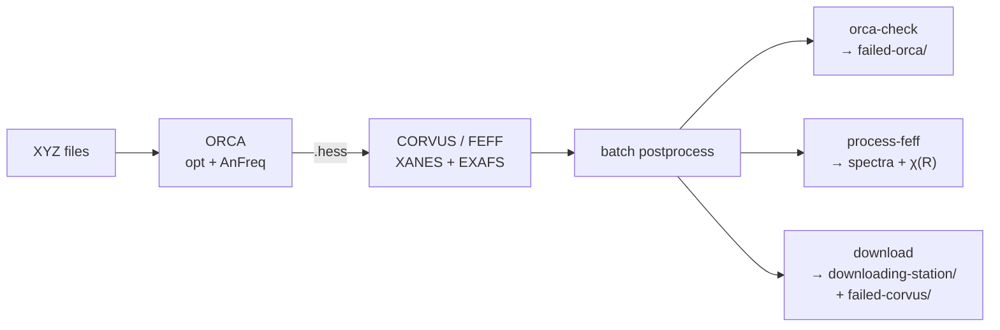

<div align="center">

# xas_pipeline

**Automated ORCA → CORVUS/FEFF X-ray absorption spectroscopy pipeline**

Geometry-optimize with ORCA, build FEFF inputs from the Hessian, run CORVUS for
XANES & EXAFS, and post-process the spectra — orchestrated in Python, submitted
to SLURM or PBS.


</div>

---

## What it does

For each input structure the pipeline runs a dependency-chained batch:



`xas-run-batch` submits the **ORCA** job, a **CORVUS** job that depends on it
(`afterok`), and — once *every* CORVUS job has finished — one **postprocess** job
(`afterany`) that checks ORCA convergence, generates spectra, and stages results
for download. Failures are self-quarantining: non-converged ORCA runs move to
`failed-orca/`, failed CORVUS runs to `failed-corvus/`, and only survivors land
in `downloading-station/`.

## Install

Runs from a checkout with a virtualenv at the repo root (a `.venv/` holding the
editable install, and a `.env/` sourced by the compute-node scripts).

```bash
uv pip install -e . --python .venv/bin/python   # editable install + console scripts
cp .env.example .env                            # then edit paths for your site
```

Runtime deps: `numpy`, `matplotlib` (both required); `xraylarch` is optional and
loaded lazily for the EXAFS χ(k)→χ(R) transform (`pip install -e '.[exafs]'`).
`corvus` and the FEFF `dym2feffinp` helper are external and configured via `.env`.
FEFF10 must be built from the `inters` branch (see [Building FEFF10](#building-feff10)).

### Installing corvus

`corvus` is the domain workflow package (times-software/Corvus). It is
**installed separately** and is deliberately *not* a listed dependency or
lockfile entry — install it straight from git into the same `.venv`:

```bash
uv pip install "corvus @ git+https://github.com/times-software/Corvus.git"
```

To pin a specific branch, tag, or commit, append `@<ref>` to the URL:

```bash
# a branch
uv pip install "corvus @ git+https://github.com/times-software/Corvus.git@my-branch"
# a tag or commit
uv pip install "corvus @ git+https://github.com/times-software/Corvus.git@v1.1.4"
```

Add `--reinstall` to force a rebuild when switching refs (uv otherwise treats
the requirement as already satisfied and skips it):

```bash
uv pip install --reinstall "corvus @ git+https://github.com/times-software/Corvus.git@my-branch"
```

Because corvus is not in `uv.lock`, a plain `uv sync` will **remove** it. Use
`uv sync --inexact` (which leaves unmanaged packages alone), or re-run the
install above after any full sync. The installed source ref is recorded in
`.venv/lib/python*/site-packages/corvus-*.dist-info/direct_url.json`.

### Building FEFF10

FEFF10 is built from source on the `inters` branch — there is no installer.
Clone the repo, build the MPI binaries into `bin/MPI/` (the path corvus.conf
expects), and point corvus.conf at them. The build needs your site's OpenMPI on
`PATH`/`LD_LIBRARY_PATH`, and — specific to the `inters` branch — the
`-mcmodel=large` compiler flag (that branch has COMMON blocks totaling >2 GB, so
without it the link fails with `relocation truncated to fit: R_X86_64_PC32
against ... COMMON`; `-mcmodel=medium` is not enough).

```bash
git clone https://github.com/times-software/feff10 feff10-git-installed
cd feff10-git-installed

# 1. Reuse a working compiler config. The inters branch only ships
#    Compiler.mk.default (mpif90); a known-good one uses MPIF90 = mpifort.
#    Copy the Compiler.mk from an existing working FEFF10 (10.0.0) build.
cp <your-feff10-10.0.0>/src/Compiler.mk src/Compiler.mk

# 2. Put your site's OpenMPI + hcoll libs on PATH/LD_LIBRARY_PATH. These are the
#    same installs the pipeline uses at runtime, configured in .env as
#    PIPELINE_OPENMPI_ROOT and PIPELINE_HPCX_ROOT -- source .env to reuse them
#    (set -a; source .env; set +a), or locate your own with e.g.
#    `dirname $(command -v mpifort)` / `module show openmpi`.
export PATH="$PIPELINE_OPENMPI_ROOT/bin:$PATH"
export LD_LIBRARY_PATH="$PIPELINE_OPENMPI_ROOT/lib:$PIPELINE_HPCX_ROOT/hcoll/lib:$LD_LIBRARY_PATH"

# 3. Add -mcmodel=large to MPIFLAGS in src/Compiler.mk (edit by hand).

# 4. Build. `clean` is required after any flag change — make doesn't track
#    flag changes. DEP/*.mk are committed, so no `make deps` is needed.
make -C src clean && make -C src mpi
```

`make mpi` compiles all parallel binaries (including `dym2feffinp`) straight
into `bin/MPI/`. Point corvus at the build by setting both the `feff` and `dmdw`
keys in corvus's config (`~/.Corvus/corvus.conf`) to that `bin/MPI/` directory.

## Quickstart

```bash
# End-to-end batch (this is all you normally run):
xas-run-batch /path/to/xyz_dir --scheduler slurm --out-dir /path/to/batch

# Preview everything without touching the scheduler:
xas-run-batch /path/to/xyz_dir --scheduler slurm --no-submit
```

Every command has an equivalent `python -m` form — e.g.
`python -m xas_pipeline.orchestrate …` — which is what the generated compute-node
scripts use (no PATH assumptions). The `xas-*` console scripts are for humans.

## Commands

| Command | Module | What it does |
|---|---|---|
| **`xas-run-batch`** | `xas_pipeline.orchestrate` | Orchestrates the whole ORCA → CORVUS → postprocess batch |
| `xas-prepare-orca` | `xas_pipeline.stages.orca_prep` | Fill ORCA templates + job scripts from XYZ files |
| `xas-prepare-corvus` | `xas_pipeline.stages.corvus_prep` | Parse `.hess` → `.dym`, fill CORVUS inputs (per run dir) |
| `xas-orca-check` | `xas_pipeline.stages.orca_check` | Convergence check; quarantine → `failed-orca/`; timing CSV |
| `xas-process-feff` | `xas_pipeline.stages.feff_process` | Plots, χ(R) FFT, copy spectra into `output-<id>/` |
| `xas-download` | `xas_pipeline.stages.download` | Collect survivors → `downloading-station/`; quarantine → `failed-corvus/` |
| `xas-submit-corvus` | `xas_pipeline.cli.submit_corvus` | CORVUS-only submit for a batch whose ORCA is already done |
| `xas-rerun-corvus` | `xas_pipeline.cli.rerun_corvus` | Re-run one CORVUS mode on a finished batch (archives prior results) |
| `xas-rerun-orca` | `xas_pipeline.cli.rerun_orca` | Triage one failed ORCA run and auto-resubmit it with SCF/OOM/opt-restart remedies (see [Automatic ORCA re-submission](#automatic-orca-re-submission-self-healing)) |
| `xas-cleanup` | `xas_pipeline.stages.cleanup` | Reclaim disk (deny-list; **dry-run by default**) |
| `xas-count-imag-freq` | `xas_pipeline.stages.count_imag_freq` | Standalone: tally imaginary-frequency warnings |

`--scheduler {pbs,slurm}` defaults to `$PIPELINE_SCHEDULER` (else `pbs`).
`run-batch`, `submit-corvus`, and `rerun-corvus` accept `--no-submit`/`--dry-run`.

<details>
<summary><b>Running individual stages</b></summary>

```bash
# 1. ORCA inputs + job scripts (mode flag picks the template; default is CA-fixed)
xas-prepare-orca <xyz_dir_or_file> --out-dir <batch> --scheduler slurm [--dry-run]
#    modes: --H --single --free --backbone --quick --quick-ca-fixed --xtb-free --xtb-constrained

# 2. CORVUS prep inside one run dir (.hess -> .dym -> FEFF inputs)
xas-prepare-corvus <run_dir> --run-id <ID> --scheduler slurm --corvus-mode both --num-procs 16

# --- postprocess trio, run over the batch root ---
xas-orca-check   <batch_root> --output-dir <batch_root>
xas-process-feff <batch_root> --recursive
xas-download     <batch_root> -d <batch_root>/downloading-station [--refresh]
```

**Re-run / maintenance**

```bash
xas-submit-corvus <batch_dir> --corvus-mode both              # ORCA done -> submit CORVUS only
xas-rerun-corvus  <batch_root> --corvus-mode xanes [--ids a,b]  # re-run one mode (after editing a template)
xas-rerun-orca    <run_dir> --scheduler slurm [--no-submit]    # triage+resubmit one failed ORCA run (usually automatic)
xas-cleanup       <batch_dir>                                  # preview deletions
xas-cleanup       <batch_dir> --execute                        # actually delete
```
</details>

## Automatic ORCA re-submission (self-healing)

When an ORCA job fails, its own end-of-run hook (in the generated job script)
immediately calls `xas-rerun-orca <run_dir>`, which **cancels the dependent
CORVUS job** (submitted `afterok`, so it can never run now) and decides —
deterministically, from the ORCA log — whether resubmitting with adjusted
settings is worth trying, and if so resubmits ORCA **plus a fresh dependent
CORVUS** job. This fires **per structure the instant a run fails**, so a
2-second charge error is handled right away instead of waiting for the batch
postprocess convergence check (which only runs once *every* job in the batch —
including any multi-day ones — has finished). The batch `xas-orca-check` remains
the backstop/reporter.

Cancelling the stale CORVUS matters beyond tidiness: left alone it sits as a
`DependencyNeverSatisfied` job forever, and the whole-batch postprocess (queued
`afterany` on all CORVUS jobs) then never runs. The job id is read from
`batch-jobs.log`; the cancel is recorded there too (`CANCELLED`).

**Diagnosis → remedy.** The log failure signature selects the fix:

| Log signature | Diagnosis | Remedy | Auto? |
|---|---|---|:--:|
| `...is odd and number of electrons...` | charge/multiplicity parity | fix charge or re-carve | ✗ human |
| `No memory left for COSX` / `Increase the %MAXCORE` | OOM (RIJCOSX/AnFreq) | bump `%MaxCore` + `--mem` (×1.6, ×2.5) | ✓ |
| `SCF has not converged` **+** `Small HOMO/LUMO gap` | near-degeneracy limit cycle | level shift + `SlowConv` (+MOREAD/opt-restart) → stronger shift | ✓ |
| `SCF has not converged`, energy stable | last-mile stall | `SlowConv` + MOREAD → + level shift | ✓ |
| `SCF has not converged`, energy moving | divergence | `SlowConv` + level-shift, fresh guess | ✓ |
| `...did not converge...maximum number...` | geometry opt | restart opt from last geometry | ✓ |
| post-opt module crash / generic crash / no log | — | — | ✗ human |

`MOREAD` (read prior orbitals) is used only when a non-empty `<id>.gbw` exists;
opt-restart (swap the geometry for the last completed one) only when ≥2 geometry
cycles ran. Each remedy is applied to the **pristine original** `<id>.in` (kept
in `<id>-rerun-history/`), so cards never stack across attempts.

**Bounded ladder.** At most `MAX_ATTEMPTS` (=2) automatic reruns per structure;
attempt 1 is the gentle fix, attempt 2 escalates. Anything not auto-remediable,
or a ladder that runs out, is **escalated to a human** — recorded in the same
channels as every other outcome, not a bespoke file:

* `<id>-rerun-state.json` — the authoritative per-structure record: one entry per
  attempt (kind, remedy, job id) plus a terminal `resolution` (`needs_human`).
  Per-structure, so no write contention, and it makes re-triage idempotent.
* `batch-jobs.log` — a `NEEDS_HUMAN` outcome line with the reason, for
  discoverability next to every other outcome. Best-effort only: this log is now
  appended from compute nodes, so treat the JSON state as the source of truth.

Triage stdout/stderr is captured in `<id>-rerun.log`.

**Turning it off.** Set `XAS_AUTO_RERUN=0` in the job environment. The hook is
also a no-op if `xas-rerun-orca` is not on `PATH` (it is inherited from the
submitting venv via Slurm `--export=ALL`), so the pipeline degrades safely to the
old report-only behaviour.

> **Note.** These jobs run `! AnFreq`, so the SCF remedies use a **level shift**,
> not finite-temperature smearing — fractional occupations are incompatible with
> the response (CPHF) step and ORCA aborts at input check. A converged run past a
> near-zero gap is still worth a manual sanity check (HOMO-LUMO gap, spin state).

## Use as a library

The pure parsers and transforms are importable and directly testable:

```python
from xas_pipeline.chem import periodic, xyz, hessian, feff
periodic.atomic_number_from_token("Zn")     # -> 30
Z, masses, coords = xyz.read_xyz(path)       # coords in Bohr
H, natoms = hessian.read_orca_hessian(path)
r, chir = feff.xftf_larch(k, chi, ...)       # χ(k) -> χ(R) (lazy larch)

from xas_pipeline import templates, scheduler, layout, config, resources
scheduler.default_scheduler_name()           # $PIPELINE_SCHEDULER, else "pbs"
resources.template_root()                    # packaged bash templates
config.SCRATCH_EXCLUDE_GLOBS                  # shared scratch deny-list
```

## Layout

```
src/xas_pipeline/
  config.py        .env loading + shared constants (SCRATCH_EXCLUDE_GLOBS)
  scheduler.py     Scheduler strategy (SLURM/PBS: submit cmd, dep flag, job-id parse)
  layout.py        batch-dir conventions (skip set, scan, split/flat, quarantine)
  templates.py     [TOKEN] placeholder fill/render engine
  resources.py     locate packaged templates + repo root
  batch_log.py     batch-jobs.log outcomes
  diagnosis.py     failed ORCA log -> (FailureKind, Evidence)  [pure]
  remedy.py        (kind, evidence, attempt) -> Remedy ladder  [pure]
  input_remedy.py  apply a Remedy to an ORCA .in               [pure]
  rerun_state.py   per-run auto-rerun attempt counter + resolution
  chem/            pure parsers: periodic, xyz, hessian, feff
  stages/          orca_prep, corvus_prep, orca_check, feff_process, download,
                   cleanup, count_imag_freq  (each has a main())
  cli/             rerun_corvus, submit_corvus, rerun_orca
  orchestrate.py   run-batch core (dependency graph, JobRecord/BatchState)
  data/            bash templates (orca-templates/, {slurm,pbs}-scripts/, corvus-*.in)
```

Bash templates ship as **package data** under `src/xas_pipeline/data/` — edit them
there. Human entry points are `xas-*` console scripts; internal machinery invokes
`python -m xas_pipeline...`.

## Site configuration (`.env`)

Site-specific paths (MPI/compiler installs, `ORCA_HOME`, the FEFF `dym2feffinp`
helper, `run-corvus`, scratch root, scheduler) live in a `.env` at the repo root
instead of being hardcoded. Copy `.env.example` → `.env` (gitignored) and edit.

- Bash job/wrapper templates source it (`set -a; source .env; set +a`); Python
  loads it via `xas_pipeline.config`. The generators inject the absolute `.env`
  path into each generated script so it resolves on compute nodes.
- Anything unset falls back to the scheduler-appropriate default baked into the
  template, so an absent `.env` reproduces stock behavior.
- Values already exported in the environment are never overridden.
- `PIPELINE_SCHEDULER` (or `--scheduler`) selects `pbs` (default) or `slurm`.

## Development

```bash
.venv/bin/python -m pytest -q          # 94 tests
```

The suite is **unit tests** (pure helpers in `chem/` + sizing/scheduler logic)
plus **golden CLI tests** that run each stage via `python -m` under
`--dry-run`/`--no-submit` and snapshot the generated scripts (path/timestamp
normalized). Regenerate goldens after an intentional change:

```bash
GOLDEN_UPDATE=1 .venv/bin/python -m pytest tests/cli/<file>
```

Goldens stop at "correct files generated" — real ORCA/FEFF/CORVUS runs and live
`sbatch`/`qsub` aren't exercised here.

## Reading charge & multiplicity

`prepare-orca` reads charge/multiplicity from XYZ header line 2:

- `CHARGE_ROUNDED=<int>`, `ROUNDED_CHARGE=<int>`, or `CHARGE=<int>`
- `MULTIPLICITY=<int>` (or `MULT=<int>`)
