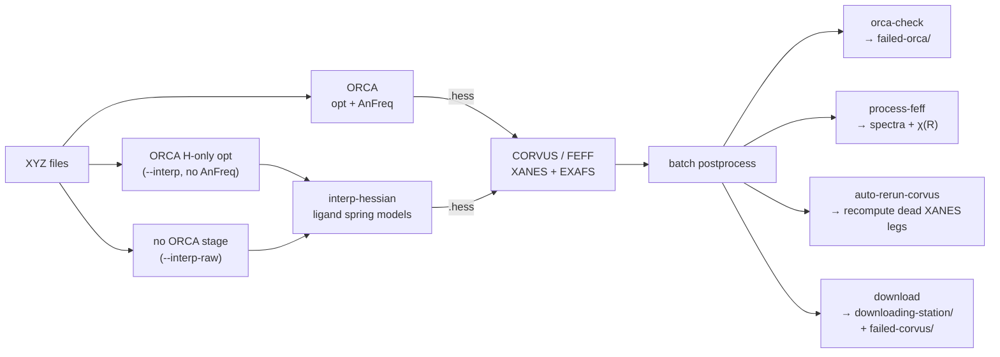

<div align="center">

# xas_pipeline

**Automated ORCA → CORVUS/FEFF X-ray absorption spectroscopy pipeline**

Geometry-optimize with ORCA, build FEFF inputs from the Hessian, run CORVUS for
XANES & EXAFS, and post-process the spectra — orchestrated in Python, submitted
to SLURM or PBS.


</div>

---

## What it does

For each input structure the pipeline runs a dependency-chained batch:



`xas-run-batch` submits the **ORCA** job, a **CORVUS** job that depends on it
(`afterok`), and — once *every* CORVUS job has finished — one **postprocess** job
(`afterany`) that checks ORCA convergence, generates spectra, and stages results
for download. Failures are self-quarantining: non-converged ORCA runs move to
`failed-orca/`, failed CORVUS runs to `failed-corvus/`, and only survivors land
in `downloading-station/`.

### ORCA modes, and where their results land

The mode flag picks the ORCA template (default: CA-fixed). Each mode gets its own
run directory, named `<id>-<mode>`, nested under a group directory named for the
starting structure — so you can run several modes from the *same* XYZ into the
*same* batch root and compare them side by side, with nothing overwritten:

```bash
xas-run-batch xyz_dir --out-dir batch                 # ca-fixed  (default)
xas-run-batch xyz_dir --out-dir batch --free          # unconstrained opt
xas-run-batch xyz_dir --out-dir batch --interp        # H-only opt + interpolated Hessian
xas-run-batch xyz_dir --out-dir batch --interp-raw    # no ORCA at all + interpolated Hessian
```

`--interp-raw` is the one mode with **no ORCA job**: its CORVUS job is submitted
with no dependency, and `prepare-orca` scaffolds the run dir without writing an
ORCA input or job script.

```
batch/
  2j6a_ZN_cluster1/                       <- group dir: one starting structure
    2j6a_ZN_cluster1-ca-fixed/            <- run dir; its name is the run id
    2j6a_ZN_cluster1-free/
    2j6a_ZN_cluster1-interp-hopt/
  downloading-station/
    2j6a_ZN_cluster1/                     <- grouping is mirrored here
      2j6a_ZN_cluster1-ca-fixed/
      ...
```

The run id is the run dir's name and every artifact is named after it
(`<run_id>.in`, `<run_id>.hess`, `xas-<run_id>.dat`), so per-mode outputs stay
distinct all the way into the download station. Batches created before this
grouping — flat `<id>/` run dirs with no mode suffix — are still scanned
correctly by every stage.

Adding a mode to a batch that **already ran** works the same way. The existing
run dir stays exactly where it is and simply gains a sibling inside it; both are
picked up by every stage:

```
first-set/2j6a_ZN_cluster1/working-2j6a_ZN_cluster1/    <- the original run
                          /output-2j6a_ZN_cluster1/
                          /2j6a_ZN_cluster1-interp-hopt/  <- added later
```

### Postprocess: one job per batch, gated on everything

The batch postprocess (orca-check → process-feff → cleanup →
auto-rerun-corvus → download) runs **once the whole batch root is finished**, not
once per submission. You get that by default; the details only matter if
something looks surprising:

- Submitting a second mode into a batch makes the new postprocess wait for the
  *first* mode's CORVUS jobs as well, and **replaces** (cancels) the earlier
  postprocess, which was gated only on its own jobs and would now fire too early.
  Job ids come from `batch-jobs.log`; ids the scheduler has already forgotten are
  dropped, so adding a mode to a months-old batch does not build a dependency on
  jobs that no longer exist.
- `auto-rerun-corvus` recomputes the runs whose XANES leg came back dead and
  takes them out of `corvus-failed-ids.txt`, so the download stage leaves their
  run dirs in place — see [Automatic CORVUS
  re-computation](#automatic-corvus-re-computation-dead-xanes-legs). It sits
  after cleanup (nothing prunes a recompute mid-flight) and before download (the
  quarantine pass must see the rewritten manifest).
- `orca-check` **skips runs whose ORCA job is still going** (a `<id>-orca.timing`
  with no `exit_code=`) rather than judging them crashed. Without this, a
  postprocess that ran early would move a live run dir into `failed-orca/`
  mid-calculation.

Take manual control with:

```bash
xas-run-batch xyz_dir --out-dir batch --interp --no-postprocess   # submit no postprocess
xas-postprocess batch --submit    # one job, waiting on whatever is still outstanding
xas-postprocess batch             # or just run it here, now
```

### `--interp` / `--interp-raw`: Hessian without AnFreq

Both modes skip the analytic-frequency step (their templates deliberately omit
`! AnFreq`) and get the Hessian CORVUS needs *interpolated* from pre-built
per-ligand spring models instead. They differ only in what happens to the
geometry first:

| flag | mode | ORCA stage | geometry into FEFF |
| --- | --- | --- | --- |
| `--interp` | `interp-hopt` | `TightOPT` with `optimizehydrogens` | protons relaxed, heavy atoms as carved |
| `--interp-raw` | `interp-raw` | none | exactly as handed in |

`--interp` optimizes the hydrogens because that is where carved clusters go wrong.
Heavy-atom positions are crystallographic, but protons are added by a protonation
step, and FEFF's muffin-tin construction is what notices: in a survey of the 14
route-A failures in `clustering-validation/4cys/first-set`, *every* one aborted on
a heavy-atom···H overlap (12 C···H, 2 S···H, never heavy···heavy) with `MOVRLP-1`
or `tell authors to INCREASE NOVP`. Relaxing the protons moves exactly the atoms
responsible.

`--interp-raw` skips ORCA entirely. Pointed at a carved cluster it computes the
same spectrum the older single-point `interp` mode did — a single point moves no
atoms — for none of the cost. Pointed at an already-optimized geometry it is what
`opt-interp` does, reachable from `xas-run-batch` rather than by hand. The
trade-off is that ORCA is also the only stage that inspects the geometry before
FEFF does, so a malformed cluster now fails later and with a worse error.

The older single-point `interp` mode is still recognized, so run dirs already on
disk keep their meaning, but no flag produces it any more.

In both cases the CORVUS wrapper runs
`xas_pipeline.stages.interp_hessian` before `prepare-corvus`: it locates every
occurrence of each ligand in the cluster by subgraph isomorphism, interpolates
that ligand's spring constants to the observed bond lengths, and builds the
`.hess` from the geometry's bond vectors. The result is written in ORCA `.hess`
format and read by the same parser as a real one, so nothing downstream changes.

This trades the (expensive) analytic-frequency step for a model Hessian — useful
when you want Debye-Waller factors for many structures without paying for AnFreq
on each. Two things to watch:

- **Ligand coverage.** The packaged models live in
  `src/xas_pipeline/data/interp-ligands/` (`ZnHis`, `ZnHis_2`, `ZnCys`; the two
  histidine files are *not* alternatives — the two ring nitrogens coordinate
  differently, so both are searched). A ligand with no model contributes no
  springs, leaving those atoms coupled only through whatever else matched.
  Restrict or extend the set with `--ligand FILE` (repeatable) on the stage.
- **Imaginary modes.** The stage diagonalizes the Hessian and reports imaginary
  frequencies beyond the six trans/rot modes. Expect some in the *raw* spring
  Hessian: the shipped models contain negative spring constants (8/36 pairs in
  `ZnCys`, 38/120 in `ZnHis`), and each reference model is itself slightly
  unstable at its *own* reference geometry — 1 imaginary mode for `ZnCys`, 3–4
  for the `ZnHis` pair, worst around −100 cm⁻¹. So imaginary modes are largely
  inherited from the models, not evidence that the interpolation misfired. They
  are reported as a `NOTE:`, and `--min-freq-scale` (below) then repairs them; a
  `WARNING:` means some survived the repair.
- **Inter-ligand coupling and the eigenvalue floor.** Two knobs keep the model
  Hessian well-conditioned, both on by default:
  - `--add-inter-ligand SCALE` (default `1.0`) floors *every* pair's spring
    constant at `SCALE ×` a hydrogen bond (0.005 Ha/Bohr²). The ligand models
    describe nothing *between* ligands, which leaves the cluster
    under-constrained — on the test cluster, 9 floppy zero modes on top of the 6
    trans/rot ones, and 4 imaginary modes. With the floor on, the null space is
    exactly 6 and the raw Hessian has no imaginary modes. The cost: it couples
    distant atoms that are not physically correlated, which slightly *lowers*
    Debye-Waller σ² on long FEFF paths. Pass `0` to disable.
  - `--min-freq-scale SCALE` (default `1.0`) raises every eigenvalue below
    `SCALE × max(eigval) / 1000²` to that floor, pins the trans/rot modes to
    exactly zero, and rebuilds the Hessian from the repaired spectrum. Pass `0`
    to write the raw Hessian. **This is only safe when the null space really is
    six-dimensional** — with `--add-inter-ligand 0` the extra floppy modes are
    numerically degenerate with the trans/rot ones, so the six that get pinned
    are an arbitrary basis of that subspace and the acoustic sum rule breaks
    (~6e-6 Ha/Bohr² on the test cluster). Turn both off together, not just one.
- **Extrapolation clamp.** `--extrap-limits LOW HIGH` (default `-2 2`) bounds the
  per-pair interpolation parameter α, where α=0 and α=1 are the two reference
  bond lengths. Two references whose bond lengths barely differ otherwise send α
  to huge values, and in log space that runs away exponentially — one pair on the
  test cluster came out at 0.90 Ha/Bohr², stiffer than the Zn–S bond beside it.
- **Hydrogen-swap degeneracies.** A ligand with interchangeable hydrogens has
  graph automorphisms, so the search returns one match per H permutation (48 for
  `ZnCys` on a Cys₄ cluster). These describe the same bonds and are averaged and
  reported as a single count, not as per-pair warnings. A disagreement involving
  a heavy atom is a real ambiguity in the ligand definition and *is* warned about.

Secondary knobs, rarely needed: `--bond-factor` / `--bond-cutoff` (what counts as
bonded, default `d <= 1.2 * (r_i + r_j)`), `--no-extrapolate` (clamp α to `[0,1]`
instead of extrapolating), `--zero-negative` (drop the models' negative spring
constants rather than carrying them), `--skip-modes` (how many lowest-|freq| modes
the imaginary-mode report ignores, default 6), and `--no-freq-check` (skip
diagonalization entirely on large systems — note this also disables the eigenvalue
floor that rides on it).

Run it by hand on an existing run dir with:

```bash
python -m xas_pipeline.stages.interp_hessian <run_dir> --run-id <ID>
```

It writes `<ID>.hess` plus `spring.model`, the merged constants it actually used
— the only record of what the subgraph search matched.

## Install

Runs from a checkout with a virtualenv at the repo root (a `.venv/` holding the
editable install, and a `.env/` sourced by the compute-node scripts).

```bash
uv pip install -e . --python .venv/bin/python   # editable install + console scripts
cp .env.example .env                            # then edit paths for your site
```

Runtime deps: `numpy`, `matplotlib` (both required); `xraylarch` is optional and
loaded lazily for the EXAFS χ(k)→χ(R) transform (`pip install -e '.[exafs]'`).
`corvus` and the FEFF `dym2feffinp` helper are external and configured via `.env`.
FEFF10 must be built from the `inters` branch (see [Building FEFF10](#building-feff10)).

### Installing corvus

`corvus` is the domain workflow package (times-software/Corvus). It is
**installed separately** and is deliberately *not* a listed dependency or
lockfile entry — install it straight from git into the same `.venv`:

```bash
uv pip install "corvus @ git+https://github.com/times-software/Corvus.git"
```

To pin a specific branch, tag, or commit, append `@<ref>` to the URL:

```bash
# a branch
uv pip install "corvus @ git+https://github.com/times-software/Corvus.git@my-branch"
# a tag or commit
uv pip install "corvus @ git+https://github.com/times-software/Corvus.git@v1.1.4"
```

Add `--reinstall` to force a rebuild when switching refs (uv otherwise treats
the requirement as already satisfied and skips it):

```bash
uv pip install --reinstall "corvus @ git+https://github.com/times-software/Corvus.git@my-branch"
```
Current development is on the `xas_input` Corvus branch.

Because corvus is not in `uv.lock`, a plain `uv sync` will **remove** it. Use
`uv sync --inexact` (which leaves unmanaged packages alone), or re-run the
install above after any full sync. The installed source ref is recorded in
`.venv/lib/python*/site-packages/corvus-*.dist-info/direct_url.json`.

### Building FEFF10

FEFF10 is built from source on the `inters` branch — there is no installer.
Clone the repo, build the MPI binaries into `bin/MPI/` (the path corvus.conf
expects), and point corvus.conf at them. The build needs your site's OpenMPI on
`PATH`/`LD_LIBRARY_PATH`, and — specific to the `inters` branch — the
`-mcmodel=large` compiler flag (that branch has COMMON blocks totaling >2 GB, so
without it the link fails with `relocation truncated to fit: R_X86_64_PC32
against ... COMMON`; `-mcmodel=medium` is not enough).

```bash
git clone https://github.com/times-software/feff10 feff10-git-installed
cd feff10-git-installed

# 1. Reuse a working compiler config. The inters branch only ships
#    Compiler.mk.default (mpif90); a known-good one uses MPIF90 = mpifort.
#    Copy the Compiler.mk from an existing working FEFF10 (10.0.0) build.
cp <your-feff10-10.0.0>/src/Compiler.mk src/Compiler.mk

# 2. Put your site's OpenMPI + hcoll libs on PATH/LD_LIBRARY_PATH. These are the
#    same installs the pipeline uses at runtime, configured in .env as
#    PIPELINE_OPENMPI_ROOT and PIPELINE_HPCX_ROOT -- source .env to reuse them
#    (set -a; source .env; set +a), or locate your own with e.g.
#    `dirname $(command -v mpifort)` / `module show openmpi`.
export PATH="$PIPELINE_OPENMPI_ROOT/bin:$PATH"
export LD_LIBRARY_PATH="$PIPELINE_OPENMPI_ROOT/lib:$PIPELINE_HPCX_ROOT/hcoll/lib:$LD_LIBRARY_PATH"

# 3. Add -mcmodel=large to MPIFLAGS in src/Compiler.mk (edit by hand).

# 4. Build. `clean` is required after any flag change — make doesn't track
#    flag changes. DEP/*.mk are committed, so no `make deps` is needed.
make -C src clean && make -C src mpi
```

`make mpi` compiles all parallel binaries (including `dym2feffinp`) straight
into `bin/MPI/`. Point corvus at the build by setting both the `feff` and `dmdw`
keys in corvus's config (`~/.Corvus/corvus.conf`) to that `bin/MPI/` directory.

## Quickstart

```bash
# End-to-end batch (this is all you normally run):
xas-run-batch /path/to/xyz_dir --scheduler slurm --out-dir /path/to/batch

# Preview everything without touching the scheduler:
xas-run-batch /path/to/xyz_dir --scheduler slurm --no-submit
```

Every command has an equivalent `python -m` form — e.g.
`python -m xas_pipeline.orchestrate …` — which is what the generated compute-node
scripts use (no PATH assumptions). The `xas-*` console scripts are for humans.

## Commands

| Command | Module | What it does |
|---|---|---|
| **`xas-run-batch`** | `xas_pipeline.orchestrate` | Orchestrates the whole ORCA → CORVUS → postprocess batch |
| `xas-prepare-orca` | `xas_pipeline.stages.orca_prep` | Fill ORCA templates + job scripts from XYZ files |
| `xas-prepare-corvus` | `xas_pipeline.stages.corvus_prep` | Parse `.hess` → `.dym`, fill CORVUS inputs (per run dir) |
| `xas-interp-hessian` | `xas_pipeline.stages.interp_hessian` | Build `<ID>.hess` from ligand spring models instead of ORCA (see [`--interp` / `--interp-raw`](#--interp----interp-raw-hessian-without-anfreq)) |
| `xas-orca-check` | `xas_pipeline.stages.orca_check` | Convergence check; quarantine → `failed-orca/`; timing CSV |
| `xas-process-feff` | `xas_pipeline.stages.feff_process` | Plots, χ(R) FFT, copy spectra into `output-<id>/` |
| `xas-download` | `xas_pipeline.stages.download` | Collect survivors → `downloading-station/`; quarantine → `failed-corvus/` |
| `xas-submit-corvus` | `xas_pipeline.cli.submit_corvus` | CORVUS-only submit for a batch whose ORCA is already done |
| `xas-rerun-corvus` | `xas_pipeline.cli.rerun_corvus` | Re-run one CORVUS mode on a finished batch (archives prior results) |
| `xas-auto-rerun-corvus` | `xas_pipeline.cli.auto_rerun_corvus` | Triage a batch's CORVUS failures and recompute the dead XANES legs (see [Automatic CORVUS re-computation](#automatic-corvus-re-computation-dead-xanes-legs)) |
| `xas-rerun-orca` | `xas_pipeline.cli.rerun_orca` | Triage one failed ORCA run and auto-resubmit it with SCF/OOM/opt-restart remedies (see [Automatic ORCA re-submission](#automatic-orca-re-submission-self-healing)) |
| `xas-postprocess` | `xas_pipeline.cli.postprocess` | Run (or submit) the postprocess over a batch root; `xas-run-batch` does this for you |
| `xas-cleanup` | `xas_pipeline.stages.cleanup` | Reclaim disk (deny-list; **dry-run by default**) |
| `xas-count-imag-freq` | `xas_pipeline.stages.count_imag_freq` | Standalone: tally imaginary-frequency warnings |

`--scheduler {pbs,slurm}` defaults to `$PIPELINE_SCHEDULER` (else `pbs`).
`run-batch`, `submit-corvus`, `rerun-corvus`, and `auto-rerun-corvus` accept
`--no-submit`/`--dry-run`. `--corvus-mode` accepts only `xas`: one CORVUS run
reads `xanes.in` and `exafs.in` and emits the combined spectrum, so there are no
longer separate `xanes`/`exafs`/`both` targets.

**Controlling the postprocess.** `xas-run-batch` builds the postprocess job from
these; each `--skip-*` drops one stage from it, and they apply to the job it
generates, not to a `xas-postprocess` you run yourself:

| Flag | Effect |
|---|---|
| `--skip-extract` | no ORCA convergence check / timing CSV |
| `--skip-process-feff` | no spectra, plots, or χ(R) |
| `--skip-prepare-download` | nothing staged into `downloading-station/` |
| `--skip-cleanup` | keep the FEFF scratch (`dmdw.out`, `*.bin`, `gg.dat`) and any `.rerun-*` snapshots — use when a spectrum needs diagnosing |
| `--no-postprocess` | submit no postprocess job at all |
| `--download-destination DIR` | stage somewhere other than `<batch>/downloading-station` |
| `--state-file PATH` | explicit path for the plain-text state log |

`xas-rerun-corvus` takes `--skip-cleanup` and `--download-destination` too, plus
`--tag` to name the archive suffix for the results it moves aside (default
`rerun-<UTC timestamp>`).

<details>
<summary><b>Running individual stages</b></summary>

```bash
# 1. ORCA inputs + job scripts (mode flag picks the template; default is CA-fixed)
xas-prepare-orca <xyz_dir_or_file> --out-dir <batch> --scheduler slurm [--dry-run]
#    modes: --H --single --free --backbone --quick --quick-ca-fixed --xtb-free
#           --xtb-constrained --interp --interp-raw
#    --interp-raw writes no ORCA input or job script at all
#    run dirs land at <batch>/<id>/<id>-<mode>/

# 1b. Only for the interp modes: build <ID>.hess from ligand spring models
#     (the generated CORVUS wrapper does this automatically)
python -m xas_pipeline.stages.interp_hessian <run_dir> --run-id <ID>

# 2. CORVUS prep inside one run dir (.hess -> .dym -> FEFF inputs)
xas-prepare-corvus <run_dir> --run-id <ID> --scheduler slurm --corvus-mode xas --num-procs 16

# --- postprocess, run over the batch root ---
# every stage in order (what the postprocess job runs):
xas-postprocess  <batch_root> [--refresh]
xas-postprocess  <batch_root> --submit          # ...or as a job, gated on outstanding CORVUS

# or a single stage at a time:
xas-orca-check   <batch_root> --output-dir <batch_root>
xas-process-feff <batch_root> --recursive
xas-cleanup      <batch_root> --execute
xas-auto-rerun-corvus <batch_root> --scheduler slurm [--no-submit]
xas-download     <batch_root> -d <batch_root>/downloading-station [--refresh]
```

**Re-run / maintenance**

```bash
xas-submit-corvus <batch_dir> --corvus-mode xas               # ORCA done -> submit CORVUS only
xas-rerun-corvus  <batch_root> --corvus-mode xas [--ids a,b]   # re-run CORVUS (after editing a template)
xas-rerun-orca    <run_dir> --scheduler slurm [--no-submit]    # triage+resubmit one failed ORCA run (usually automatic)
xas-auto-rerun-corvus <batch_root> [--no-submit]               # recompute the dead XANES legs of a batch (usually automatic)
xas-cleanup       <batch_dir>                                  # preview deletions
xas-cleanup       <batch_dir> --execute                        # actually delete
```
</details>

## Automatic ORCA re-submission (self-healing)

When an ORCA job fails, its own end-of-run hook (in the generated job script)
immediately calls `xas-rerun-orca <run_dir>`, which **cancels the dependent
CORVUS job** (submitted `afterok`, so it can never run now) and decides —
deterministically, from the ORCA log — whether resubmitting with adjusted
settings is worth trying, and if so resubmits ORCA **plus a fresh dependent
CORVUS** job. This fires **per structure the instant a run fails**, so a
2-second charge error is handled right away instead of waiting for the batch
postprocess convergence check (which only runs once *every* job in the batch —
including any multi-day ones — has finished). The batch `xas-orca-check` remains
the backstop/reporter.

Cancelling the stale CORVUS matters beyond tidiness: left alone it sits as a
`DependencyNeverSatisfied` job forever, and the whole-batch postprocess (queued
`afterany` on all CORVUS jobs) then never runs. The job id is read from
`batch-jobs.log`; the cancel is recorded there too (`CANCELLED`).

**Diagnosis → remedy.** The log failure signature selects the fix:

| Log signature | Diagnosis | Remedy | Auto? |
|---|---|---|:--:|
| `...is odd and number of electrons...` | charge/multiplicity parity | fix charge or re-carve | ✗ human |
| `No memory left for COSX` / `Increase the %MAXCORE` | OOM (RIJCOSX/AnFreq) | bump `%MaxCore` + `--mem` (×1.6, ×2.5) | ✓ |
| `SCF has not converged` **+** `Small HOMO/LUMO gap` | near-degeneracy limit cycle | level shift + `SlowConv` (fresh guess) → stronger shift | ✓ |
| `SCF has not converged`, energy stable | last-mile stall | `SlowConv` → + level shift | ✓ |
| `SCF has not converged`, energy moving | divergence | `SlowConv` + level-shift, fresh guess | ✓ |
| `...did not converge...maximum number...` | geometry opt | restart opt from last geometry | ✓ |
| post-opt module crash / generic crash / no log | — | — | ✗ human |

SCF remedies use a **fresh guess** (no `MOREAD`): the GBW from a non-converged
SCF can error-terminate in ORCA's GUESS step, and level shift + SlowConv converge
fine from scratch. (`MOREAD` is reserved for the OOM / opt-non-convergence
remedies, whose GBW comes from a *converged* SCF.) Opt-restart (swap the geometry
for the last completed one — geometry only, no orbitals) is used when ≥2 geometry
cycles ran. Each remedy is applied to the **pristine original** `<id>.in` (kept
in `<id>-rerun-history/`), so cards never stack across attempts.

**Bounded ladder.** At most `MAX_ATTEMPTS` (=2) automatic reruns per structure;
attempt 1 is the gentle fix, attempt 2 escalates. Anything not auto-remediable,
or a ladder that runs out, is **escalated to a human** — recorded in the same
channels as every other outcome, not a bespoke file:

* `<id>-rerun-state.json` — the authoritative per-structure record: one entry per
  attempt (kind, remedy, job id) plus a terminal `resolution` (`needs_human`).
  Per-structure, so no write contention, and it makes re-triage idempotent.
* `batch-jobs.log` — a `NEEDS_HUMAN` outcome line with the reason, for
  discoverability next to every other outcome. Best-effort only: this log is now
  appended from compute nodes, so treat the JSON state as the source of truth.

Triage stdout/stderr is captured in `<id>-rerun.log`.

**Turning it off.** Set `XAS_AUTO_RERUN=0` in the job environment. The hook is
also a no-op if `xas-rerun-orca` is not on `PATH` (it is inherited from the
submitting venv via Slurm `--export=ALL`), so the pipeline degrades safely to the
old report-only behaviour.

**Applies to newly generated batches only.** The hook lives in the generated
job script, so it self-heals batches submitted **after** this feature landed.
Run dirs generated earlier have hook-less scripts — resubmitting one triages
nothing. To retriage an old failure by hand, run `xas-rerun-orca <run_dir>`
directly (it reads the current `<id>-orca.log`); note it diagnoses whatever the
*latest* log says, so if a previous manual rerun overwrote the original failure
log, restore/rebuild the input rather than relying on re-diagnosis.

> **Note.** These jobs run `! AnFreq`, so the SCF remedies use a **level shift**,
> not finite-temperature smearing — fractional occupations are incompatible with
> the response (CPHF) step and ORCA aborts at input check. A converged run past a
> near-zero gap is still worth a manual sanity check (HOMO-LUMO gap, spin state).

## Automatic CORVUS re-computation (dead XANES legs)

A CORVUS run can exit 0 and still produce a **dead XANES leg**: the xanes
`xmu.dat` comes back with `chi` identically `0.0000000000E+00` on every row —
`mu == mu0` throughout, no fine structure, no structural information. Nothing in
the FEFF headers says so. The `0/0 paths used` line means nothing for XANES (it
is an FMS calculation, not a path expansion), which is exactly why the postprocess
gate used to check only the *exafs* component and let these through as good
spectra.

**The gate now looks at the numbers.** `xas-process-feff` reads the xanes chi
column (`chem.feff.scan_chi_column`), and an all-zero column fails the id like any
other CORVUS failure — `corvus-failed-ids.txt`, a `FAILED` line in
`batch-jobs.log` naming the row count. A *partly* zero column (a truncated or
patched grid) or a NaN/inf one is printed as a warning, not failed: it is
suspicious, not dead.

**And the pipeline recomputes it.** `xas-auto-rerun-corvus` runs inside the
postprocess job, between `cleanup` and `download`:

1. reads the failed-id manifest `xas-process-feff` just wrote;
2. re-derives each id's verdict from disk (`xas_pipeline.corvus_diagnosis`) rather
   than parsing failure text, and keeps only the auto-remediable kind;
3. hands those ids to `xas-rerun-corvus`'s machinery — archive the dead output
   aside, resubmit the corvus wrapper, queue one follow-up postprocess
   (`afterok`) that re-derives the spectra and triages again;
4. drops the resubmitted ids from `corvus-failed-ids.txt`, so the download stage
   in that same job leaves their run dirs alone instead of quarantining a
   directory a queued job is about to write into.

The stage ordering is load-bearing: **after** cleanup, so nothing prunes a
recompute mid-flight, and **before** download, so the quarantine pass reads the
rewritten manifest.

**Why a plain recompute is a real remedy.** Unlike the ORCA failures, there is
nothing to fix in the input. The XANES leg is not bit-reproducible — the same
geometry, same inputs, run twice, gives spectra that differ near the edge — and
the zero-chi failure is sporadic rather than structural, so a recompute of the
same inputs normally comes back clean. That is the *only* CORVUS failure kind that
is auto-remediable:

| Verdict | Meaning | Auto? |
|---|---|:--:|
| `xanes_zero_chi` | xanes chi identically 0 (dead XANES leg) | ✓ recompute |
| `missing_spectrum` | no `Corvus.cfavg_xas.out` at all | ✗ human |
| `malformed_spectrum` | deliverable unreadable / not a 6-column table | ✗ human |
| `no_exafs_paths` | exafs `xmu.dat` reports `0/0 paths used` | ✗ human |

Everything else points at the inputs, the Hessian, or a killed job — rerunning it
unchanged would fail the same way.

**Bounded ladder.** At most `MAX_ATTEMPTS` (=2) automatic recomputes per run,
counted in `<id>-corvus-rerun-state.json` (a separate file from the ORCA ladder's
`<id>-rerun-state.json`, so the two counters never interfere). When the ladder
runs out the run is escalated exactly as an ORCA one is: `resolution=needs_human`
in the state file, a `NEEDS_HUMAN` line in `batch-jobs.log`, and the id stays in
the manifest so `xas-download` quarantines it into `failed-corvus/`. The count is
cumulative over the run dir's lifetime — delete the state file to grant a run a
fresh ladder.

**Turning it off.** `XAS_AUTO_RERUN=0` in the job environment — the same switch as
the ORCA hook (the postprocess job sources the pipeline `.env`). `--no-submit`
previews the triage without archiving, submitting or recording anything.

To survey batches instead of gating them, `calculations/scan-xanes-zero-chi.py`
reports the same buckets across a whole tree (including archived output), with
per-mode and per-batch tallies.

## Use as a library

The pure parsers and transforms are importable and directly testable:

```python
from xas_pipeline.chem import periodic, xyz, hessian, feff
periodic.atomic_number_from_token("Zn")     # -> 30
Z, masses, coords = xyz.read_xyz(path)       # coords in Bohr
H, natoms = hessian.read_orca_hessian(path)
r, chir = feff.xftf_larch(k, chi, ...)       # χ(k) -> χ(R) (lazy larch)
feff.scan_chi_column(xmu_path).is_all_zero   # dead XANES leg? (stdlib parse)

from xas_pipeline import templates, scheduler, layout, config, resources
scheduler.default_scheduler_name()           # $PIPELINE_SCHEDULER, else "pbs"
resources.template_root()                    # packaged bash templates
config.SCRATCH_EXCLUDE_GLOBS                  # shared scratch deny-list
```

## Layout

```
src/xas_pipeline/
  config.py        .env loading + shared constants (SCRATCH_EXCLUDE_GLOBS)
  scheduler.py     Scheduler strategy (SLURM/PBS: submit cmd, dep flag, job-id parse)
  layout.py        batch-dir conventions (run-dir naming <id>-<mode>, group-dir
                   scan, skip set, split/flat, quarantine)
  templates.py     [TOKEN] placeholder fill/render engine
  resources.py     locate packaged templates + repo root
  batch_log.py     batch-jobs.log outcomes
  diagnosis.py     failed ORCA log -> (FailureKind, Evidence)  [pure]
  remedy.py        (kind, evidence, attempt) -> Remedy ladder  [pure]
  input_remedy.py  apply a Remedy to an ORCA .in               [pure]
  corvus_diagnosis.py  finished CORVUS run -> (CorvusFailureKind, reason);
                   shared by the postprocess gate and the CORVUS auto-rerun
  rerun_state.py   per-run auto-rerun attempt counter + resolution
                   (one ladder per file: ORCA and CORVUS)
  chem/            pure parsers: periodic, xyz, hessian, feff
                   springs, spring_hessian  (vendored from DW_Interpolation)
  stages/          orca_prep, corvus_prep, interp_hessian, orca_check,
                   feff_process, download, cleanup, count_imag_freq
                   (each has a main())
  cli/             rerun_corvus, auto_rerun_corvus, submit_corvus, rerun_orca,
                   postprocess
  orchestrate.py   run-batch core (dependency graph, JobRecord/BatchState)
  data/            bash templates (orca-templates/, {slurm,pbs}-scripts/, corvus-*.in)
                   interp-ligands/  pre-built .interp ligand spring models
```

Bash templates ship as **package data** under `src/xas_pipeline/data/` — edit them
there. Human entry points are `xas-*` console scripts; internal machinery invokes
`python -m xas_pipeline...`.

`chem/springs.py` and `chem/spring_hessian.py` are **vendored** from
`DW_Interpolation/scripts/` with their numerics unchanged (only the argparse CLIs
were replaced by importable functions). Upstream stays the source of truth for
the science: re-vendor from it rather than editing the numerics here.

## Site configuration (`.env`)

Site-specific paths (MPI/compiler installs, `ORCA_HOME`, the FEFF `dym2feffinp`
helper, `run-corvus`, scratch root, scheduler) live in a `.env` at the repo root
instead of being hardcoded. Copy `.env.example` → `.env` (gitignored) and edit.

- Bash job/wrapper templates source it (`set -a; source .env; set +a`); Python
  loads it via `xas_pipeline.config`. The generators inject the absolute `.env`
  path into each generated script so it resolves on compute nodes.
- Anything unset falls back to the scheduler-appropriate default baked into the
  template, so an absent `.env` reproduces stock behavior.
- Values already exported in the environment are never overridden.
- `PIPELINE_SCHEDULER` (or `--scheduler`) selects `pbs` (default) or `slurm`.

## Development

```bash
.venv/bin/python -m pytest -q          # 235 tests
```

The suite is **unit tests** (pure helpers in `chem/` + sizing/scheduler logic)
plus **golden CLI tests** that run each stage via `python -m` under
`--dry-run`/`--no-submit` and snapshot the generated scripts (path/timestamp
normalized). Regenerate goldens after an intentional change:

```bash
GOLDEN_UPDATE=1 .venv/bin/python -m pytest tests/cli/<file>
```

Goldens stop at "correct files generated" — real ORCA/FEFF/CORVUS runs and live
`sbatch`/`qsub` aren't exercised here.

## Reading charge & multiplicity

`prepare-orca` reads charge/multiplicity from XYZ header line 2:

- `CHARGE_ROUNDED=<int>`, `ROUNDED_CHARGE=<int>`, or `CHARGE=<int>`
- `MULTIPLICITY=<int>` (or `MULT=<int>`)
